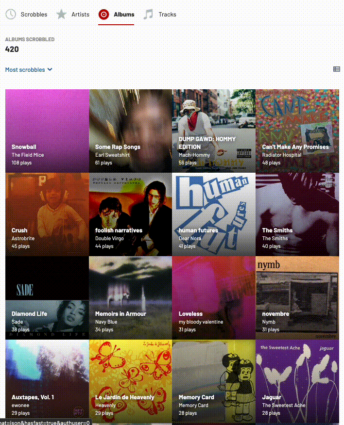

### What?

A function that removes the playcount elements for the last.fm grid view.

### Why?

Recently, Last.fm gave (pro) users the ability to change the default cover art
image for an album. I actually don't know when they did this, they are not great
at giving product updates. Anyway, I think this is great since the default album
cover was up for user voting which led to some cases where a parody album cover
was voted in. This got super annoying when using an album collage generator.
Using last.fm's grid view is a good alternative but I'm not a fan of the
playcount since it took up a lot of space. So this is just a quick solution to
be able to export a last.fm collage. If anyone from last.fm is reading this, pls
add more customization options to the Grid view :).

### How?

Copy-and-paste into the console via your browser's developer tools.

